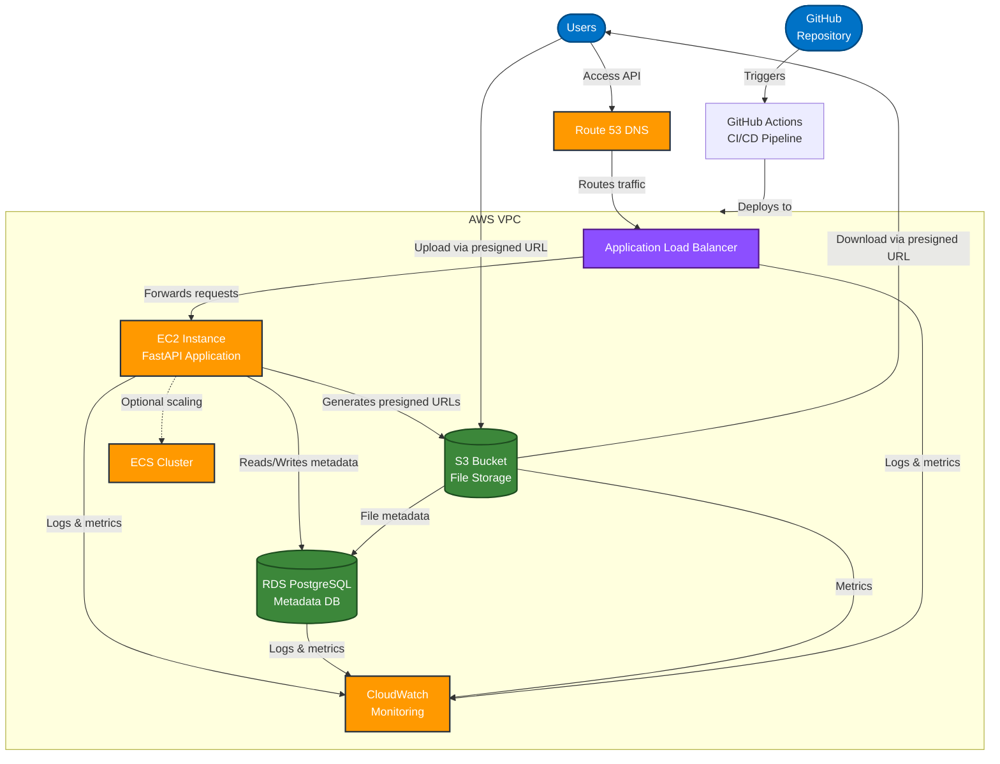

# Implementation Plan: Multi-User File Upload & Sharing Backend

This guide provides a step-by-step approach to building the We-Upload project, from local development to AWS deployment.

## System Architecture

### Architecture Components

1. **VPC (Virtual Private Cloud)**: Isolated network environment with public and private subnets
   - Public subnets for load balancers and gateways
   - Private subnets for application servers and database

2. **EC2 Instance**: Hosts the FastAPI application (t2.micro for Free Tier)
   - Runs the containerized Python application
   - Handles API requests, authentication, and business logic

3. **RDS PostgreSQL**: Managed database service (db.t3.micro for Free Tier)
   - Stores user data and file metadata
   - Managed by AWS for high availability and backups

4. **S3 Bucket**: Object storage for file data
   - Stores actual file contents (up to 5GB in Free Tier)
   - Accessible via presigned URLs generated by the API

5. **Application Load Balancer (Optional)**: Distributes incoming traffic
   - Routes HTTP/HTTPS requests to application servers
   - Provides SSL termination and health checks

6. **CloudWatch**: Monitoring and observability
   - Collects logs from application and AWS services
   - Tracks metrics and triggers alerts

7. **Route 53 (Optional)**: DNS management
   - Handles domain name resolution
   - Can be used for health checks and routing policies

8. **GitHub Actions**: CI/CD pipeline
   - Automates testing, building, and deployment
   - Manages infrastructure updates via Terraform

### Data Flow

1. Users make requests to the API through the load balancer
2. The FastAPI application processes requests and authenticates users
3. For uploads:
   - The API generates a presigned S3 URL
   - User uploads directly to S3 via the presigned URL
   - File metadata is stored in PostgreSQL
4. For downloads:
   - The API verifies user permissions
   - The API generates a presigned S3 URL for download
   - User downloads directly from S3 via the presigned URL

## Phase 1: Local Development

### Step 1: FastAPI Application Setup
- **Learning Objective**: Understand FastAPI structure and how to organize a production-ready API
- **Tasks**:
  - Set up the basic FastAPI application structure
  - Create the database models for files and users
  - Implement Pydantic schemas for request/response validation
  - Configure environment variables and application settings

### Step 2: Database Integration
- **Learning Objective**: Learn how to connect FastAPI with PostgreSQL using SQLAlchemy
- **Tasks**:
  - Set up SQLAlchemy models and database connection
  - Implement database migrations using Alembic
  - Create basic CRUD operations for file metadata

### Step 3: File Upload/Download Endpoints
- **Learning Objective**: Understand file handling in FastAPI and storage patterns
- **Tasks**:
  - Implement file upload endpoints (local storage initially)
  - Create file download endpoints
  - Add file sharing functionality and permissions

### Step 4: Docker Compose Local Setup
- **Learning Objective**: Learn containerization and multi-service orchestration
- **Tasks**:
  - Create Dockerfile for the FastAPI application
  - Set up docker-compose.yml with FastAPI and PostgreSQL services
  - Configure environment variables and network settings
  - Implement development workflows with hot-reloading

## Phase 2: AWS & Terraform Setup

### Step 1: AWS Account Setup
- **Learning Objective**: Understand AWS account structure and security best practices
- **Tasks**:
  - Create AWS account with proper IAM users and permissions
  - Set up AWS CLI and configure credentials
  - Review Free Tier limitations and monitoring

### Step 2: Core Infrastructure with Terraform
- **Learning Objective**: Learn Infrastructure as Code principles and Terraform basics
- **Tasks**:
  - Create VPC module with proper networking configuration
  - Set up IAM roles and policies for services
  - Implement S3 bucket for file storage with proper security settings

### Step 3: Database and Compute Resources
- **Learning Objective**: Understand how to provision and manage AWS database and compute services
- **Tasks**:
  - Create RDS PostgreSQL instance with Terraform
  - Set up EC2 instance or ECS cluster for API hosting
  - Configure security groups and network access rules

### Step 4: S3 Integration in FastAPI
- **Learning Objective**: Learn how to use AWS SDK and presigned URLs
- **Tasks**:
  - Modify API to use S3 for file storage instead of local storage
  - Implement presigned URL generation for secure uploads and downloads
  - Add proper error handling and retry mechanisms

## Phase 3: CI/CD with GitHub Actions

### Step 1: Setting Up Testing
- **Learning Objective**: Understand automated testing principles and implementation
- **Tasks**:
  - Create unit tests for API endpoints and services
  - Implement integration tests for database and S3 operations
  - Set up test fixtures and mocking for AWS services

### Step 2: GitHub Actions Workflows for CI
- **Learning Objective**: Learn continuous integration practices and workflow automation
- **Tasks**:
  - Create workflow for linting and testing Python code
  - Set up Docker image building and pushing to ECR
  - Implement Terraform validation and security scanning

### Step 3: Deployment Automation
- **Learning Objective**: Understand continuous deployment patterns for infrastructure and applications
- **Tasks**:
  - Create workflow for Terraform plan and apply
  - Implement deployment strategy for API updates
  - Set up environment-specific configurations

## Phase 4: Monitoring & Observability

### Step 1: CloudWatch Integration
- **Learning Objective**: Learn AWS monitoring capabilities and best practices
- **Tasks**:
  - Set up CloudWatch logging for API and database
  - Create custom metrics for application performance
  - Implement alarms for critical thresholds

### Step 2: Health Checks and Alerts
- **Learning Objective**: Understand system health monitoring and alerting strategies
- **Tasks**:
  - Create health check endpoints in the API
  - Set up Route 53 health checks or ALB health monitoring
  - Configure alerting via SNS or other notification channels

### Step 3: Performance Optimization
- **Learning Objective**: Learn how to identify and resolve performance bottlenecks
- **Tasks**:
  - Implement caching strategies for frequently accessed data
  - Optimize database queries and connections
  - Fine-tune AWS resource allocation to stay within Free Tier while maximizing performance

## Free Tier Considerations

Throughout implementation, we'll carefully consider AWS Free Tier limitations:

- **EC2**: Use t2.micro instance (750 hours/month free)
- **RDS**: Use db.t3.micro with minimal storage (750 hours/month free)
- **S3**: Stay under 5GB standard storage
- **Data Transfer**: Minimize cross-AZ traffic to reduce costs
- **CloudWatch**: Stay within the basic monitoring metrics and limit custom metrics
- **ALB**: Be aware this is not included in Free Tier - consider ALB usage carefully

## Next Steps and Extensions

After completing the core implementation, consider these enhancements:

1. Implement user authentication with AWS Cognito
2. Add file versioning and restore capabilities
3. Implement file preview generation for common file types
4. Create a simple frontend application for demonstration
5. Add virus scanning for uploaded files
6. Implement file encryption at rest and in transit
